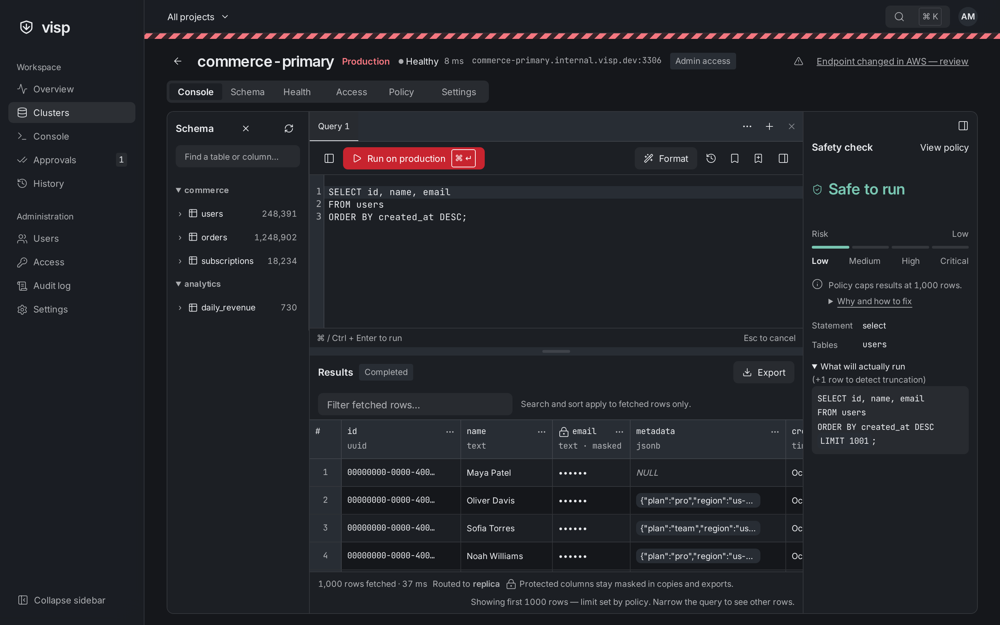
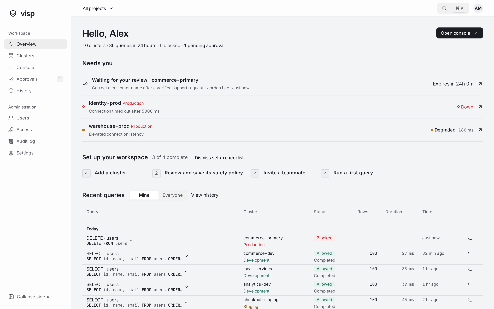
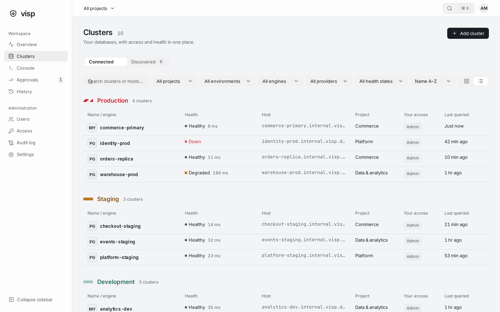
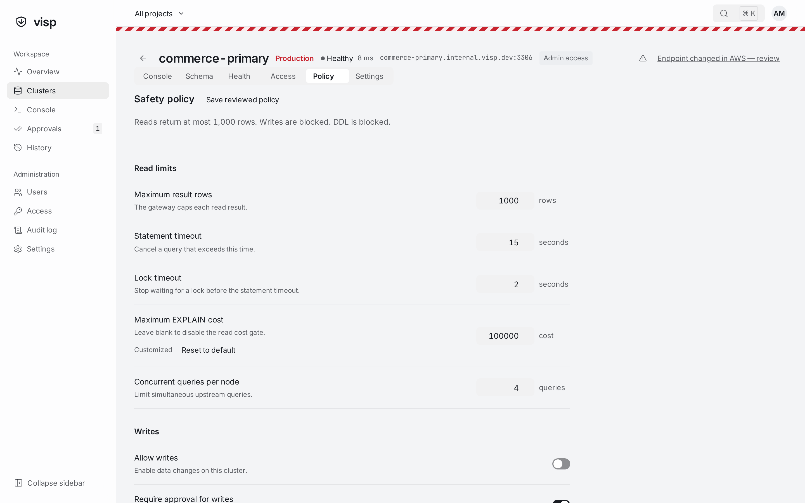
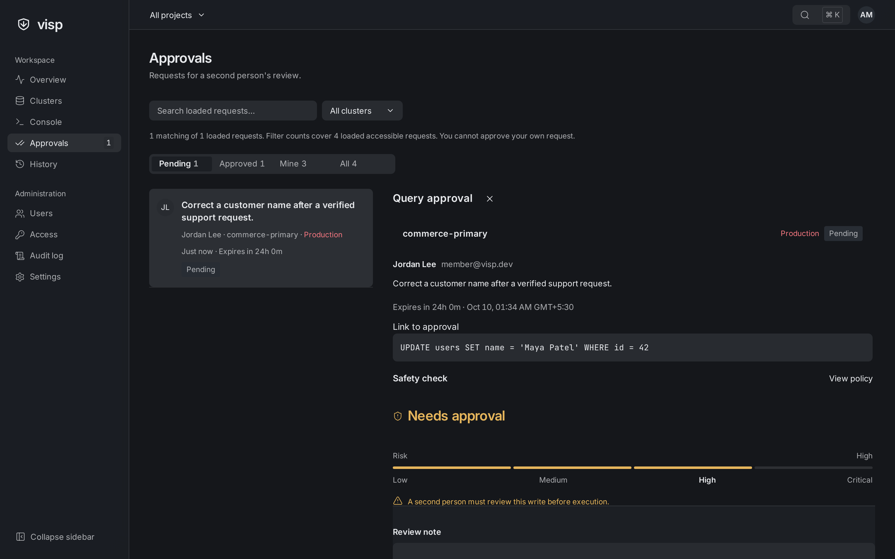

# visp-db-access

A self-hosted gateway that lets engineers query production PostgreSQL and MySQL
databases safely. Every statement is parsed, checked against the caller's access
and the cluster's policy, rewritten with hard limits, executed in a guarded
transaction, masked and audited. Engineers never see database credentials.



## Features

- **Whole-statement SQL analysis** before anything reaches the database,
  including CTEs, subqueries and nested writes (`WITH x AS (DELETE …) SELECT …`
  is a write). Unsupported SQL fails closed.
- **Read-only by default.** Writes need a grant, a policy that allows them and,
  by default, a second person's approval. DDL always needs approval.
- **Four-eyes approvals** with 24-hour expiry and a single-use execution claim;
  requester and reviewer grants are re-checked at execution.
- **Production protection:** statement and lock timeouts, row/byte/affected-row
  caps, an optional `EXPLAIN` cost gate, per-cluster concurrency limits, read
  replica routing and server-side cancellation.
- **Performance suggestions** alongside the verdict: unbounded reads,
  `SELECT *`, leading-wildcard `LIKE`, non-sargable filters and large
  `OFFSET`s, with one-click fixes such as a sample `LIMIT` or a preview of the
  rows a write will touch. Suggestions never change what is allowed.
- **Column masking**, expiring project/cluster grants, organization and cluster
  network allowlists, and an append-only audit log with full query history.
- **AWS discovery** of RDS and Aurora databases across accounts and regions,
  with explicit, credential-verified import and drift detection.
- **One binary**: a Rust server with the React console embedded. Stateless nodes,
  all state in a PostgreSQL metadata store, Docker image and Helm chart.

| Overview                              | Clusters                                                     |
| ------------------------------------- | ------------------------------------------------------------ |
|  |  |
| **Safety policy**                     | **Approvals**                                                |
|      |                  |

## Quick start

With Docker Compose, choose an initial admin password and a stable master key
(the server refuses to start without a valid 32-byte key):

```sh
export VDA_MASTER_KEY="$(openssl rand -base64 32)"
export VDA_BOOTSTRAP_ADMIN_PASSWORD='choose-a-long-random-password'
docker compose --profile demo up --build
```

Open <http://localhost:8080> and sign in as `admin@example.com`. The `demo`
profile starts PostgreSQL and MySQL databases with sample shop data; register
them in the console:

| Engine     | Host            | Port | Database | User   | Password          |
| ---------- | --------------- | ---- | -------- | ------ | ----------------- |
| PostgreSQL | `demo-postgres` | 5432 | `shop`   | `demo` | `demo-local-only` |
| MySQL      | `demo-mysql`    | 3306 | `shop`   | `demo` | `demo-local-only` |

Use the `development` environment for the demo; production defaults block writes.
Keep the master key in a secret manager and back it up with the metadata
database: stored credentials can't be decrypted with a different key.

To try the console without any backend, run the UI in mock mode:

```sh
cd web && npm ci && npm run dev:mock
```

## Documentation

| Topic                                    |                                                             |
| ---------------------------------------- | ----------------------------------------------------------- |
| [Architecture](docs/ARCHITECTURE.md)     | Components, data model, access model and query pipeline     |
| [Security model](docs/SECURITY-MODEL.md) | Guarantees, defense-in-depth layers and known limits        |
| [Deployment](docs/DEPLOYMENT.md)         | Configuration, Docker, Helm, health, metrics and operations |
| [AWS discovery](docs/DISCOVERY.md)       | IAM setup, cross-account roles, scanning and import         |
| [HTTP API](docs/API.md)                  | The v1 API contract                                         |
| [Development](docs/DEVELOPMENT.md)       | Local setup without Docker, tests and smoke tests           |
| [Design system](docs/DESIGN.md)          | The console's visual language and components                |

## Repository layout

```
crates/vda-guard        SQL safety engine (pure, no I/O)
crates/vda-connectors   Guarded execution against PostgreSQL and MySQL
crates/vda-discovery    Cloud discovery providers (AWS RDS/Aurora)
crates/vda-server       HTTP API, auth, policies, approvals, audit (binary)
web/                    React + TypeScript console, embedded in the binary
deploy/                 Helm chart, IAM policies, demo seed data
scripts/                Local development and smoke-test scripts
```

## Status

visp-db-access is pre-1.0. The API and storage schema may still change between
releases. Supported targets are PostgreSQL and MySQL (including MariaDB and their
managed variants such as RDS, Aurora, Cloud SQL and Azure Database).

Roadmap: RDS IAM authentication, GCP and Azure discovery, OIDC/SAML SSO and
SCIM, group grants, just-in-time access requests, saved queries, distributed
cancellation, durable audit delivery, more engines and bastion tunnels.

## Contributing and security

Contributions are welcome; see [CONTRIBUTING.md](CONTRIBUTING.md). Please report
vulnerabilities privately as described in [SECURITY.md](SECURITY.md).

## License

Licensed under the [Apache License, Version 2.0](LICENSE). See [NOTICE](NOTICE)
for attributions.
